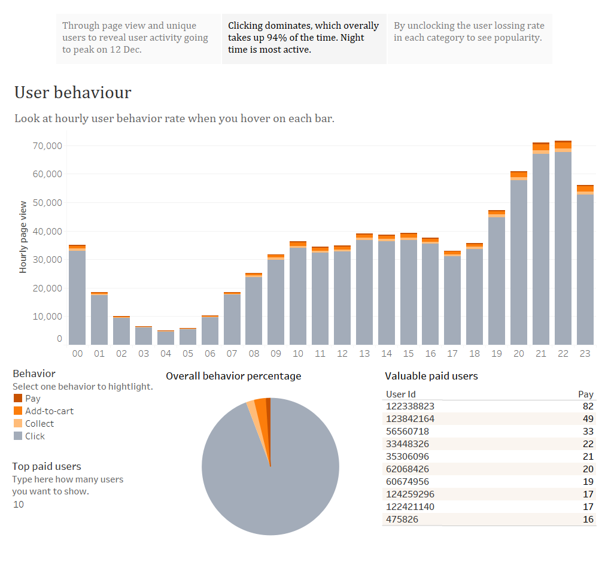

# User behavior analysis in Taobao APP

The dataset can be found in the notebook.

After I cleaned and explored the dateset in Python, I also created dashboards and story in Tableau for interactive use.

[Have a look here!](https://public.tableau.com/profile/jane.g6560#!/vizhome/userbehavioranalysis/Analysis)

I will put one of screan shots at the bottom for a quick view.

## Table of contents

* Objective

The aim is to analyze the APP user behaviors over time (date, hour duration) and the behaviors include click, collect, add-to-cart and pay. This project will explore the operations of users and reveal some interesting findings for business strategies. The analysis aspect will involve daily page view per user, daily avgerage paying times per user, user rebuy behaviors, etc. Using the detailed and powerful plot, we can clearly view the trend.

* Good points

  - Explore several KPIs.
  
  - Matplotlib and seaborn.
  
  - Subplots.
  
  - Groupby and map/apply/lambda function.
  
* Conclusion

  - 67% users are active on 12 Dec, the Chinese shopping holiday, much more than any other time.
  
  - Users are always active at 18:00pm till 12:00am.
  
  - Clicking behavior is much more active than add-to-cart, then collecting and finally paying.
  
  - Users usually rebuy no more than 10 days after they first buying.
  
  - The user lossing rate in each behaviour duration (overall and for each item category) can be analyzed.
 
 

 
